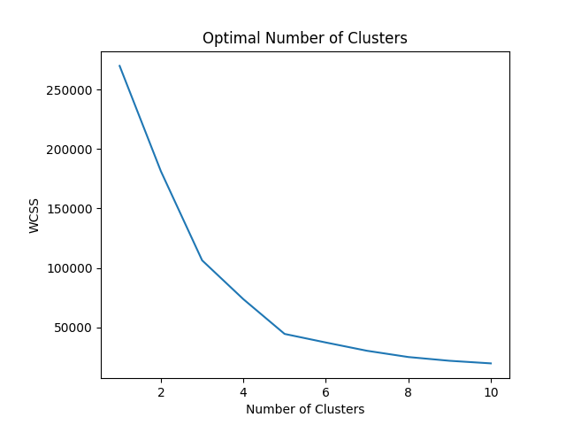
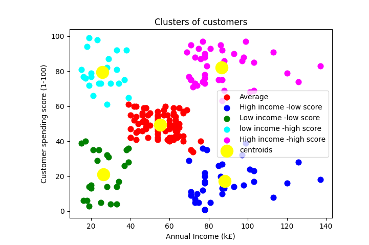

# ClusteringForTargetMarketing
```python 
import pandas as pd
import numpy as np
import matplotlib.pyplot as plt
import os

# Importing the dataset
dataset = pd.read_csv('Mall_Customers.csv')
X = dataset.iloc[:, [3,4]].values

# Finding an optimal number of clusters using elbow method
from sklearn.cluster import KMeans
wcss = []
for i in range(1, 11):
    kmeans = KMeans(n_clusters = i, init= 'k-means++', random_state=42)
    kmeans.fit(X)
    wcss.append(kmeans.inertia_)
plt.plot(range(1, 11), wcss)
plt.title('Optimal Number of Clusters')
plt.xlabel('Number of Clusters')
plt.ylabel('WCSS')
plt.show()
```


```python 

# Training the clustering algorithm on the data
kmeans = KMeans(n_clusters = 5, init= 'k-means++', random_state=42)
y_kmeans = kmeans.fit_predict(X)

plt.scatter(X[y_kmeans == 0 ,0], X[y_kmeans == 0 ,1], s = 60, c = 'red', label = 'Average')
plt.scatter(X[y_kmeans == 1 ,0], X[y_kmeans == 1 ,1], s = 60, c = 'blue', label = 'High income -low score')
plt.scatter(X[y_kmeans == 2 ,0], X[y_kmeans == 2 ,1], s = 60, c = 'green', label = 'Low income -low score')
plt.scatter(X[y_kmeans == 3 ,0], X[y_kmeans == 3 ,1], s = 60, c = 'cyan', label = 'low income -high score')
plt.scatter(X[y_kmeans == 4 ,0], X[y_kmeans == 4 ,1], s = 60, c = 'magenta', label = 'High income -high score')
plt.scatter(kmeans.cluster_centers_[:, 0], kmeans.cluster_centers_[:, 1], s = 300, c = 'yellow', label = 'centroids')
plt.title('Clusters of customers')
plt.xlabel('Annual Income (k£)')
plt.ylabel('Customer spending score (1-100)')
plt.legend()
plt.show()
```

